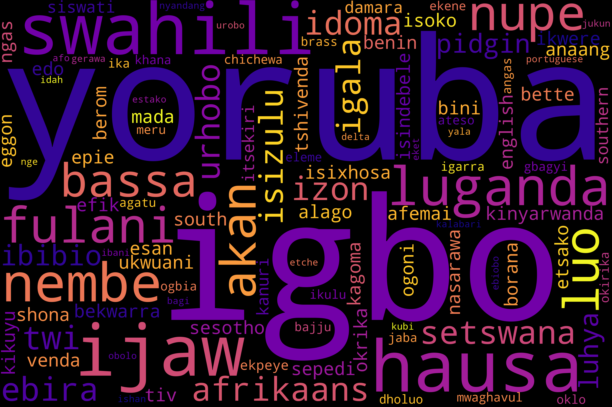

<!-- # Markdown Files -->
<!-- Whether you write your book's content in Jupyter Notebooks (`.ipynb`) or
in regular markdown files (`.md`), you'll write in the same flavor of markdown
called **MyST Markdown**.
This is a simple file to help you get started and show off some syntax. -->

<!-- MyST stands for "Markedly Structured Text". It
is a slight variation on a flavor of markdown called "CommonMark" markdown,
with small syntax extensions to allow you to write **roles** and **directives**
in the Sphinx ecosystem.

For more about MyST, see [the MyST Markdown Overview](https://jupyterbook.org/content/myst.html). -->


# AfriSpeech Dataset

AFRISPEECH-200 [AfriSpeech on huggingface](https://huggingface.co/datasets/tobiolatunji/afrispeech-200) is a 200hr ~120GB Pan-African 
speech corpus for clinical and general domain English accented ASR. A dataset with 120 African accents from 13 countries and 2,463 unique African speakers. 
The training dataset consists of 57,819 recordings, while the development dataset contains 3,227 recordings. Additionally, the test dataset comprises of 5,070 recordings.

The dataset comprises of information from two distinct domains, namely healthcare, which accounts for approximately 60% of the data, and a general domain, which constitutes around 40% of the dataset. The general domain encompasses various topics such as news, sports, entertainment, politics, and content
sourced from Wikipedia. Each audio clip has a duration of approximately 11 seconds. These recordings originate from 13 distinct countries, encompassing
a wide range of accents from West, South, and East Africa, totaling 120 different accents. The goal is to raise awareness for and advance Pan-African English ASR research.  

## AfriSpeech Language distribution


The most common accent is Yoruba, which originated in southwest Nigeria in West Africa, followed by Igbo and Swahili, which originated in South-Eastern Nigeria and East and South Africa, respectively, with speakers distributed over Kenya, Tanzania, South Africa, and Uganda.
Bagi, Estako, and Gerawa are Nigerian accents that are less common in the dataset. To read more about how this dataset was created, go to [AfriSpeech-200 paper](https://arxiv.org/pdf/2310.00274.pdf).

<!-- ## Bibliography

```{bibliography}
```  -->

<!-- ## Sample Roles and Directives

Roles and directives are two of the most powerful tools in Jupyter Book. They
are kind of like functions, but written in a markup language. They both
serve a similar purpose, but **roles are written in one line**, whereas
**directives span many lines**. They both accept different kinds of inputs,
and what they do with those inputs depends on the specific role or directive
that is being called.

Here is a "note" directive:

```{note}
Here is a note
``` -->

<!-- It will be rendered in a special box when you build your book.

Here is an inline directive to refer to a document: {doc}`markdown-notebooks`.
 -->

<!-- ## Citations

You can also cite references that are stored in a `bibtex` file. For example,
the following syntax: `` {cite}`holdgraf_evidence_2014` `` will render like
this: {cite}`holdgraf_evidence_2014`.

Moreover, you can insert a bibliography into your page with this syntax:
The `{bibliography}` directive must be used for all the `{cite}` roles to
render properly.
For example, if the references for your book are stored in `references.bib`,
then the bibliography is inserted with:
 -->
 
<!--
```{bibliography}
``` 
-->

<!--## Learn more

This is just a simple starter to get you started.
You can learn a lot more at [jupyterbook.org](https://jupyterbook.org). -->
